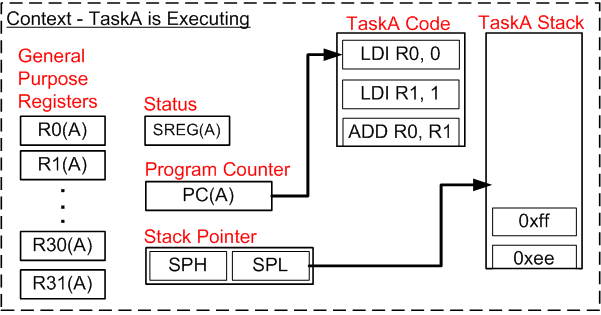

Here I implemented a small cooperative scheduler to prevent the Blocking behavior of function:\
1- implement the design using the cooperative schaduler.(Finished)\
2- implement the design and use a small pre-emptive schaduler.(To Do)\
3- implement the function design itself to prevent this behavior it is more like pre-emptive schaduler method.

How pre-emptive schaduler work:\
This example starts with TaskA executing.\
TaskB has previously been suspended so its context has already been stored on the TaskB stack.
TaskA has the context demonstrated by the diagram below.

